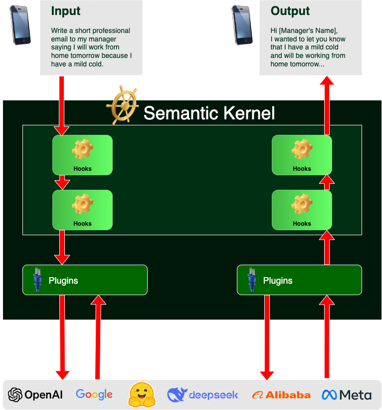

# Semantic Kernel Typescript

Semantic Kernel Typescript is an unofficial port of Microsoft's [Semantic Kernel](https://learn.microsoft.com/en-us/semantic-kernel) SDK. It lets you easily build AI agents and integrate the latest AI models into your Typescript codebase. It serves as an efficient middleware that enables rapid delivery of AI solutions in Typescript.

This port is modelled specifically after Semantic Kernel Java. It is designed to be future proof, easily connecting your code to the latest AI models evolving with the technology as it advances. When new models are released, you’ll simply swap them out without needing to rewrite your entire codebase.

It combines prompts with existing APIs to perform actions. By describing your existing code to AI models, they’ll be called to address requests. When a request is made the model calls a function, and Semantic Kernel Typescript is the middleware translating the model's request to a function call and passes the results back to the model.
